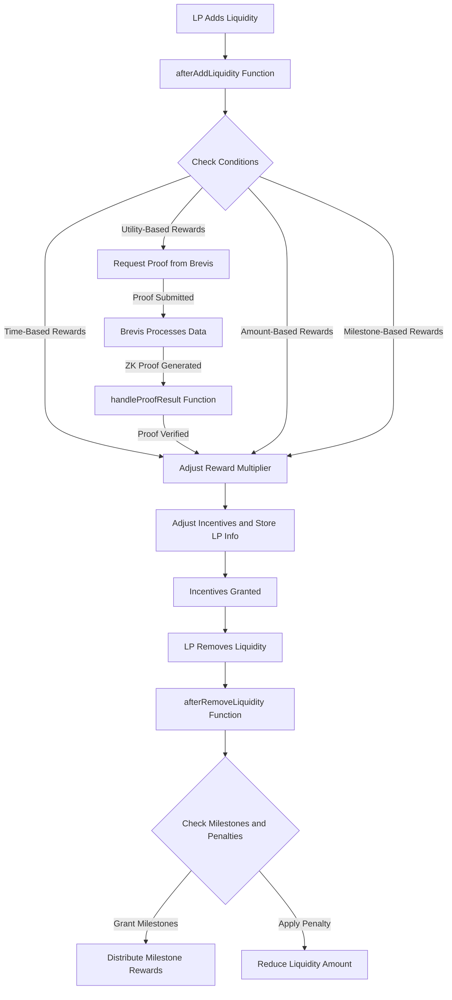

# LiquidityIncentiveHook

## Overview

The `LiquidityIncentiveHook` contract is a customized PancakeSwap V4 hook designed to incentivize liquidity providers (LPs) through various reward mechanisms. This contract leverages Brevis's ZK coprocessor to fetch and verify historical on-chain data, enabling dynamic and data-driven reward adjustments based on liquidity conditions.

### Key Features
- **Utility-Based Rewards**: Incentivizes LPs during volatile periods or low liquidity based on verified data from Brevis.
- **Time-Based Rewards**: Rewards proportional to the duration of liquidity provision.
- **Amount-Based Rewards**: Higher rewards for consistent large liquidity contributions.
- **Milestone-Based Rewards**: Incentives for maintaining liquidity over consecutive days.
- **Cross-Platform Rewards**: Future potential to integrate cross-platform rewards using LayerZero or Brevis.
- **Boosted Rewards for Lockup**: Incentives proportional to the duration of liquidity lockup.

## How It Works

The contract utilizes Brevis to handle proof requests and data access, allowing it to make data-driven decisions for liquidity incentives. Brevis provides verified proofs of data computations, which are then used to adjust the incentives offered to LPs based on historical liquidity and volatility data.

### Workflow Diagram

## Usage

### Contract Interaction

1. **Adding Liquidity**: When an LP adds liquidity, the `afterAddLiquidity` function is triggered. This function calculates rewards based on various criteria, including the duration of liquidity, market conditions, and lockup time.

2. **Brevis Proof Request**: For utility-based rewards, the contract requests proof from Brevis, which processes the request and submits a ZK-proof of historical liquidity and volatility data.

3. **Handling Proof Results**: The `handleProofResult` function verifies the proof using a designated verifying key (`vkHash`). If the proof is valid, the contract adjusts rewards based on the decoded data.

4. **Removing Liquidity**: When an LP removes liquidity, the `afterRemoveLiquidity` function checks for milestones and applies any penalties for early withdrawal. Milestone rewards are distributed if conditions are met.

### Functions

- `afterAddLiquidity`: Manages liquidity addition, calculates rewards, and requests data from Brevis.
- `calculateRewardMultiplier`: Computes reward multipliers based on time, amount, and other conditions.
- `isLowLiquidityPeriod`: Determines low liquidity conditions using Brevis data.
- `handleProofResult`: Processes and verifies proof data submitted by Brevis.
- `afterRemoveLiquidity`: Handles logic for removing liquidity, including milestone validation and penalty application.

## Security Considerations

- **ZK Proof Verification**: The contract uses ZK proofs from Brevis to ensure the authenticity of the data used in reward calculations. This prevents manipulation and maintains the integrity of the incentivization process.
- **Penalty Mechanisms**: Penalties discourage early withdrawals, ensuring liquidity stability and rewarding long-term participation.

## Future Enhancements

- **Cross-Platform Incentives**: Explore integrations with other platforms like LayerZero for cross-chain liquidity incentivization.
- **Advanced Data Analytics**: Use additional Brevis features to further refine reward mechanisms based on broader DeFi market trends.

## Installation

To deploy and interact with the `LiquidityIncentiveHook` contract, follow these steps:

# Built from Pancake v4 hooks template

[`Use this Template`](https://github.com/new?owner=pancakeswap&template_name=pancake-v4-hooks-template&template_owner=pancakeswap)

## Prerequisite

1. Install foundry, see https://book.getfoundry.sh/getting-started/installation

## Running test

1. Install dependencies with `forge install`
2. Run test with `forge test`